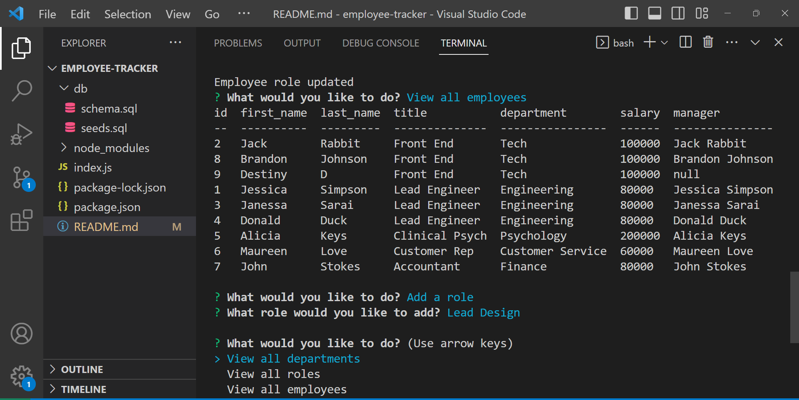

# Employee Tracker

## Description
This is a command-line application to manage a companys employee database, this project uses Node.js, Inquirer, and MySQL. This project can be started by typing 'node index.js' in the terminal. 

## Usage
Open the integrated terminal, cd to the db folder and type in the MySQL credentials. Run the source schema.sql and then run node index.js to be prompted for input.

## Installation 
You need to have MySQL 2, inquirer, and console.table installed for this application to work.

## Links
Video walkthrough: https://drive.google.com/file/d/1jD77006bvw91i4SI6tls8GeT_x7LKc5j/view 
Github Repo: https://github.com/destinymarie32601/employee-tracker

## Website Screenshot

## Contributions
To help me with this project I referenced this website for knowledge on console tables : https://www.npmjs.com/package/console.table as well as this GitHub repository for understanding the structure of the index.js functionality :https://github.com/blakeedwards3/employee-tracker/tree/main 